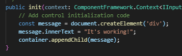
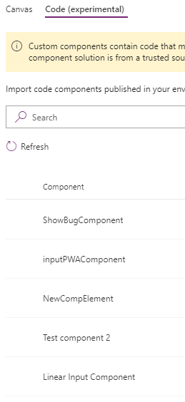

Create the app.

Modify it:

Run `msbuild /t:restore` and `msbuild`.

Import:

Code working in an empty Canvas app:

Modify component:

Modify XML:

It's ok in development mode:

Run `msbuild /t:restore` and `msbuild`.

Re-import the solution.
The pop-up windows are the same, I won't attach the pictures again. :)

Re-open the app:

Only a welcome message is shown:

The name of the previously import component has changed:

After re-importing the component, 2 components are shown:

The component is still the old one:

I've deleted all my former solutions, but their components are still visible - why?

